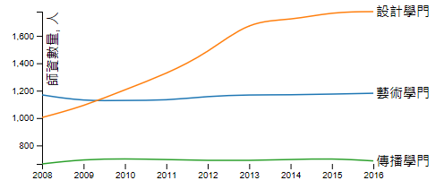
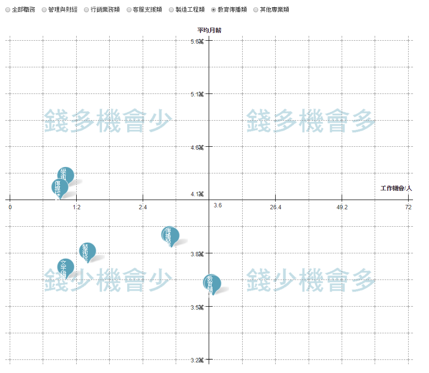
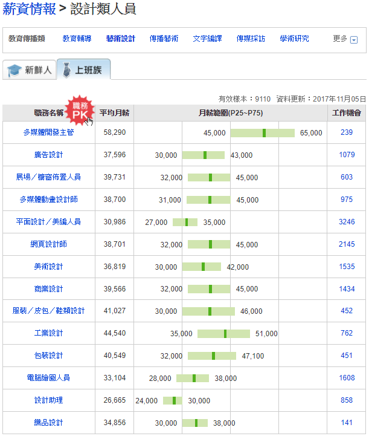
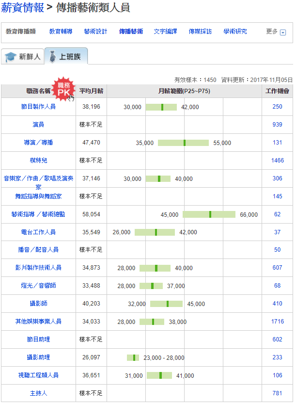

# MovieIndustryAnalyse
研究台灣相關電影產業數據

## teacher/
一般電影、廣電、動畫多在藝術、設計、傳播學門

 

資料來源:
大專校院專任教師數(含助教)-依研究類別(學門)查詢

https://stats.moe.gov.tw/qframe.aspx?qno=MgAxADQA0

## 104統計
https://www.104.com.tw/jb/wage/

我們若看藝術設計及傳播藝術這兩群工作，明顯可以看出來，在台灣選擇設計或是動畫電影都是錢少機會少的工作。

藝術設計平均月薪 NT $37,000 元
傳播藝術平均月薪 NT $38,000 元

<table>
<tr>
<td>

</td>
<td>

</td>
</tr>
</table>

